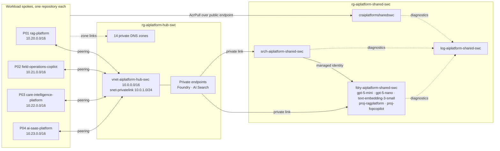

# Azure AI landing zone

One hub network, one private DNS authority, one EU-bound model endpoint and one governance
baseline in Sweden Central, so each of four AI workload repositories deploys only its own spoke.

## Architecture



Spokes reach the shared services only through the hub's private endpoints and resolve them only
through the hub's zones. Peering is non-transitive, so spokes cannot reach each other.

## Address plan

Only the hub is created here; each workload repository creates its own spoke. The whole plan is
fixed now because peered ranges must never overlap, a subnet can be resized only while it is empty,
and every address-space change on a peered network needs a peering sync on both sides.

| Network | Address space | Subnets |
|---|---|---|
| Hub | `10.0.0.0/16` | `snet-privatelink` `10.0.1.0/24` |
| P01 rag-platform | `10.20.0.0/16` | `snet-apps` `10.20.0.0/23` · `snet-privatelink` `10.20.2.0/24` |
| P02 field-operations-copilot | `10.21.0.0/16` | `snet-apps` `10.21.0.0/23` · `snet-privatelink` `10.21.2.0/24` |
| P03 care-intelligence-platform | `10.22.0.0/16` | `snet-apps` `10.22.0.0/23` · `snet-privatelink` `10.22.2.0/24` · `snet-aml` `10.22.4.0/24` |
| P04 ai-saas-platform | `10.23.0.0/16` | `snet-apps` `10.23.0.0/23` · `snet-privatelink` `10.23.2.0/24` · `snet-aks` `10.23.4.0/22` · `snet-func` `10.23.8.0/24` |

The rest of the hub range is held for a gateway, firewall or DNS resolver subnet if ADR-004 or
ADR-006 is revisited.

## Private DNS zones

The hub owns every zone the portfolio needs, links each one to the hub network and exports the IDs
as `dnsZoneIds`. Spokes link the zones they use and never create their own (ADR-004). Names match
the Learn page *Azure Private Endpoint private DNS zone values*, revision of August 2026.

| Zone | Used by |
|---|---|
| `privatelink.cognitiveservices.azure.com` | Foundry account, Content Understanding, Azure Language |
| `privatelink.openai.azure.com` | Foundry model endpoints |
| `privatelink.services.ai.azure.com` | Foundry project endpoints — without it, `FoundryChatClient` calls from a spoke resolve to the public IP and fail |
| `privatelink.search.windows.net` | AI Search |
| `privatelink.blob.core.windows.net` | Storage (P01, P02, P03) |
| `privatelink.file.core.windows.net` | Azure ML workspace storage (P03) |
| `privatelink.documents.azure.com` | Cosmos DB (P01, P02, P04) |
| `privatelink.vaultcore.azure.net` | Key Vault (P03, P04) |
| `privatelink.api.azureml.ms` | Azure ML workspace (P03) |
| `privatelink.notebooks.azure.net` | Azure ML workspace (P03) |
| `privatelink.postgres.database.azure.com` | PostgreSQL Flexible Server (P03) |
| `privatelink.redis.azure.net` | Azure Managed Redis (P04) |
| `privatelink.servicebus.windows.net` | Service Bus (P04) |
| `privatelink.eventgrid.azure.net` | Event Grid topics (P02, P04) |

The Foundry private endpoint (sub-resource `account`) registers records in the first three zones.

## Naming convention

`{type}-{workload}-{scope}-{region}` — for example `rg-aiplatform-hub-swc` or
`srch-aiplatform-shared-swc`. `workload` is `aiplatform`, `scope` is `hub` or `shared`, and
`region` is `swc` for Sweden Central in every regional name, resource groups included.

- `{type}` is the Cloud Adoption Framework abbreviation, except the Foundry account, which uses
  `fdry` rather than CAF's `aif`.
- Container Registry names allow only alphanumerics: `craiplatformsharedswc`.
- Child resources are named for their purpose: `snet-privatelink`, `proj-ragplatform`.
- Global resources have no region and no suffix: `ag-aiplatform-shared`,
  `budget-aiplatform-monthly`. Private DNS zone names are fixed by Azure.
- The Foundry subdomain, Search service and registry names are globally unique. A second
  deployment changes `workload` in `infra/main.bicepparam`.

## Identity and RBAC

No key, connection string or admin user exists: local authentication is disabled on Foundry,
AI Search and Log Analytics (ADR-003). This repository makes the first two grants; the workload
repositories make the rest, each for its own identities.

| Identity | Role | Scope | Why |
|---|---|---|---|
| AI Search, system-assigned | Cognitive Services OpenAI User | Foundry account | Embedding skill and vectorizer for integrated vectorisation |
| AI Search, system-assigned | Cognitive Services User | Foundry account | Keyless billing of built-in enrichment skills; its data actions include the role above, which is kept so vectorisation does not depend on billing |
| P01 and P02 workload identities | Foundry User (formerly Azure AI User) | Own project | `FoundryChatClient` calls and evaluation runs (ADR-008) |
| P03 and P04 workload identities | Cognitive Services OpenAI User | Foundry account | Model calls without a project |
| Workload identities | Search Index Data Reader or Contributor | AI Search | Query or load their own indexes |
| Workload runtime identities | `AcrPull` | Registry | Pull images |
| Workload CI identities | `AcrPush` | Registry | Push images |
| Workload deployment identities | Network Contributor | Hub virtual network | Create the hub side of their peering |
| Workload deployment identities | Private DNS Zone Contributor | Hub resource group | Link zones to their spoke and register their private endpoints |
| Landing zone deployment identity | Contributor, Resource Policy Contributor, Role Based Access Control Administrator | Subscription | Deploy this repository ([security.md](docs/security.md#identity)) |

## Consuming the landing zone

A workload repository reads the deployment outputs —
`az deployment sub show --name aiplatform-landing-zone --query properties.outputs --only-show-errors`,
or `azd env get-values` — or references resources by the naming convention with `existing`.

1. **Peer.** Create the spoke-to-hub peering in the spoke and the hub-to-spoke peering under
   `hubVnetId`. Neither side needs gateway transit or forwarded traffic.
2. **Resolve.** Link each zone the spoke uses from `dnsZoneIds` to the spoke network, with
   registration disabled, and point every private endpoint's DNS zone group at the same IDs.
   Never create a `privatelink` zone in a spoke.
3. **Call models.** Agent workloads target `foundryProjectEndpoints.ragplatform` or
   `.fopcopilot`; the others call `foundryEndpoint`.
4. **Enrich.** Skillsets bill to the shared Foundry account without a key:

   ```json
   "cognitiveServices": {
     "@odata.type": "#Microsoft.Azure.Search.AIServicesByIdentity",
     "subdomainUrl": "https://<foundryAccountName>.services.ai.azure.com",
     "identity": null
   }
   ```

## Deploy

Prerequisites: `az`, `azd` and `make`; DataZone Standard quota for `gpt-5-mini` and `gpt-5-nano` in
Sweden Central (ADR-002); an identity with the roles in the last row of the table above. After
`azd auth login`:

```bash
azd env new aiplatform-swc --location swedencentral --subscription <SUBSCRIPTION_ID>
azd env set ALERT_EMAIL_ADDRESS <alert-address>
azd provision
```

The first deployment leaves AI Search's billing link to Foundry pending; approve it once with
`make approve-links`. Without azd, `ALERT_EMAIL_ADDRESS=<alert-address> make deploy approve-links`
does both. `make build lint` compiles and lints every Bicep file, failing on any warning, and
`make what-if` previews the deployment.

## GitHub Actions federated credentials

Both workflows sign in with OIDC through one Entra application that holds the deployment roles.
It needs two federated credentials — issuer `https://token.actions.githubusercontent.com`, audience
`api://AzureADTokenExchange` — one for each subject GitHub presents:

| Workflow | Runs on | Subject |
|---|---|---|
| `validate.yml` — build, lint, what-if | Pull request to `main` | `repo:<org>/<repo>:pull_request` |
| `deploy.yml` — what-if, deploy, approve | Manual dispatch, `production` environment | `repo:<org>/<repo>:environment:production` |

```bash
az ad app federated-credential create --id <APP_ID> --parameters '{"name":"pull-request","issuer":"https://token.actions.githubusercontent.com","subject":"repo:<org>/<repo>:pull_request","audiences":["api://AzureADTokenExchange"]}'
az ad app federated-credential create --id <APP_ID> --parameters '{"name":"production","issuer":"https://token.actions.githubusercontent.com","subject":"repo:<org>/<repo>:environment:production","audiences":["api://AzureADTokenExchange"]}'
```

A missing or mismatched subject fails sign-in with `AADSTS700213`, and subjects are compared
case-sensitively. A job that references an environment presents the environment subject, so a
`ref:refs/heads/main` credential never matches the deploy job. The `production` environment
carries the required reviewers and a `main`-only deployment branch rule. Repository secrets:
`AZURE_CLIENT_ID`, `AZURE_TENANT_ID`, `AZURE_SUBSCRIPTION_ID` and `ALERT_EMAIL_ADDRESS`. Pull
requests from forks receive neither secrets nor an OIDC token, so their what-if step cannot run.

## Cost

€92.49 a month fixed today — AI Search Basic is two thirds of it — plus tokens, €18.42 at the
example volumes in [cost.md](docs/cost.md). The same design with every rejection reversed and
production availability costs €1,760.06; Azure Firewall alone is €783.51 of that.

## Decisions

| ADR | Decision |
|---|---|
| [001](docs/adr.md#adr-001-hub-and-spoke-network) | Hub-and-spoke network |
| [002](docs/adr.md#adr-002-datazone-standard-in-the-eu-zone-not-global-standard) | DataZone Standard in the EU zone, not Global Standard |
| [003](docs/adr.md#adr-003-managed-identity-instead-of-keys) | Managed identity instead of keys |
| [004](docs/adr.md#adr-004-private-endpoints-with-dns-owned-by-the-hub) | Private endpoints with DNS owned by the hub, and the Application Insights exception |
| [005](docs/adr.md#adr-005-rejected-a-premium-registry-behind-a-private-endpoint) | Rejected: a Premium registry behind a private endpoint |
| [006](docs/adr.md#adr-006-rejected-azure-firewall-nat-gateway-and-forced-tunnelling) | Rejected: Azure Firewall, NAT Gateway and forced tunnelling |
| [007](docs/adr.md#adr-007-rejected-terraform) | Rejected: Terraform |
| [008](docs/adr.md#adr-008-one-foundry-project-per-agent-workload) | One Foundry project per agent workload |

## Scope and simplifications

- One region, one subscription, no disaster recovery. AI Search runs one replica with no SLA.
- No firewall, NAT Gateway, gateway, on-premises connectivity, DNS Private Resolver or Azure
  Monitor Private Link Scope; the ADRs say when each becomes necessary.
- Foundry Agent Service's standard setup — bring-your-own storage, Cosmos DB and Search with
  network injection — is not deployed. Agents run in workload compute; a server-side Foundry tool
  that calls AI Search would need Search's trusted-service bypass or network injection.
- Spokes, their peerings and zone links, workload role assignments, and every Search index,
  indexer and skillset belong to the workload repositories.
- Diagnostic settings export metrics without their dimensions, so per-model charts read Azure
  Monitor metrics in the workbook instead of Log Analytics.
- Built-in role and policy definitions are referenced by public ID, with the name beside each.

### Deviations from the brief

- **Layout.** Eight ADR files are one `docs/adr.md`; `role-assignment.bicep` is gone because role
  assignments stay beside the resource they scope; `docs/architecture.md` is this README. That keeps
  the repository at 23 files.
- **Federated credentials.** The deploy job's subject is `environment:production`, not
  `ref:refs/heads/main`, because the job uses an environment.
- **Monitoring.** `queries.kql` answers per-account token use and indexer API activity; the
  per-model and per-indexer-outcome splits exist only as metrics.
- **Roles.** Azure AI User is now Foundry User; the Foundry account also grants AI Search
  Cognitive Services User, which keyless enrichment billing requires.
- **Private DNS zone names** match the documented values; none changed.
